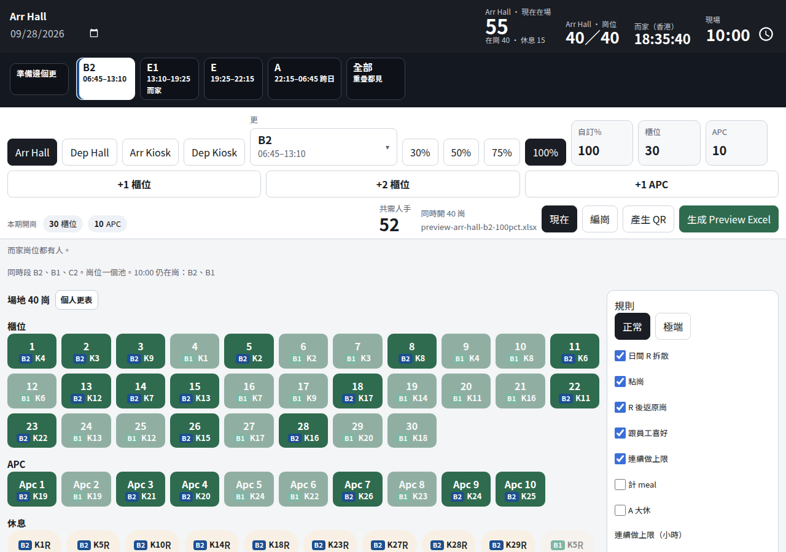
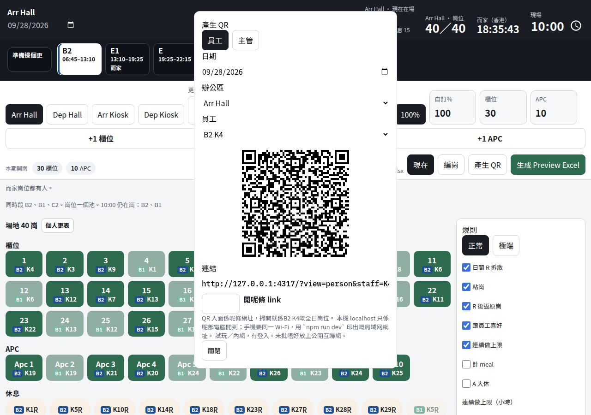
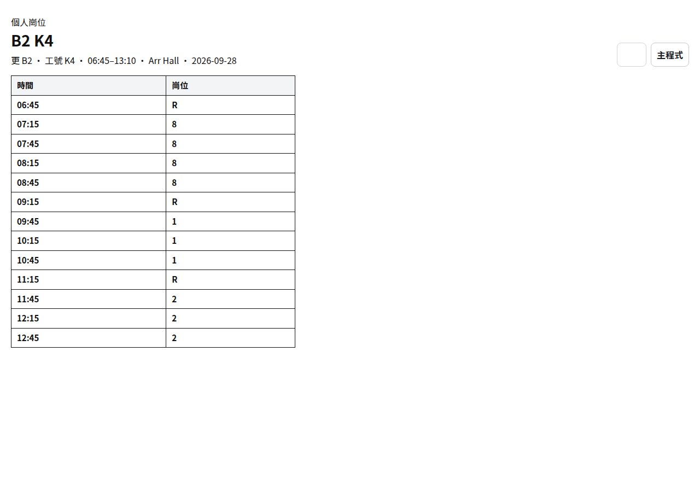
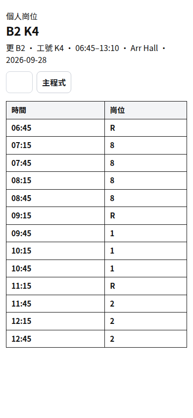
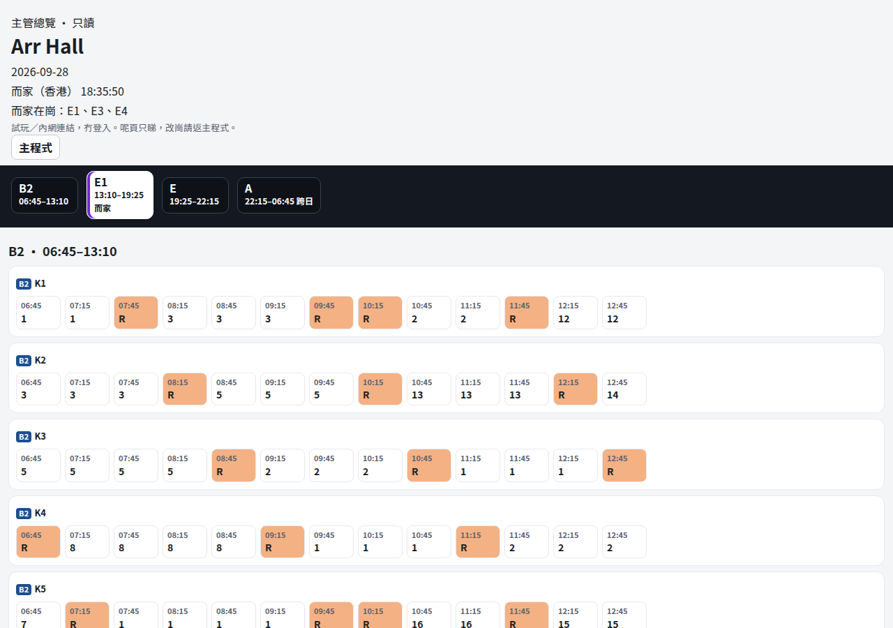
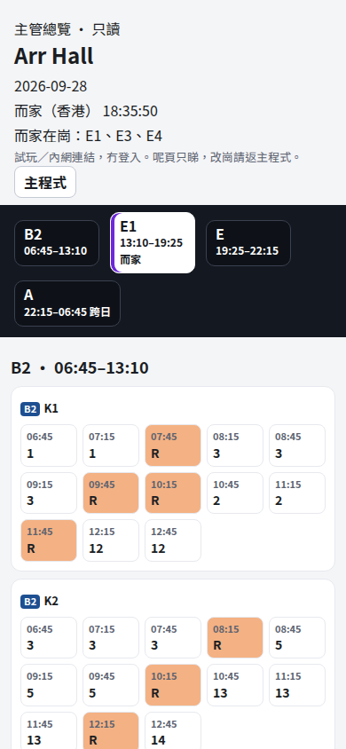
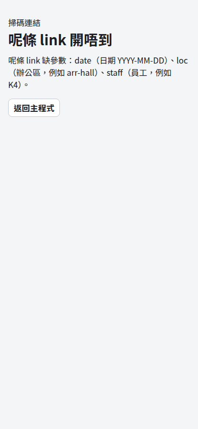
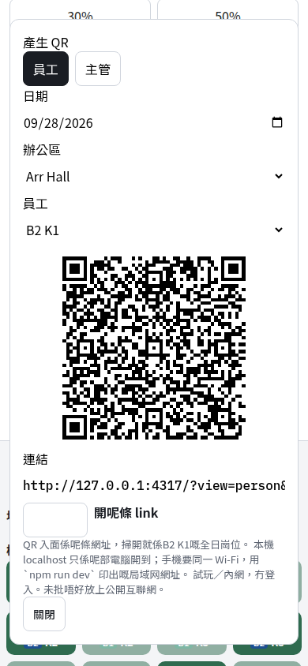

# VERIFY｜掃 QR 睇崗

日期：2026-10-02  
本機：`npm run dev`（:4317）。冇 deploy、冇改 Render。

## 點試

1. `npm install && npm run dev`
2. 電腦開 <http://127.0.0.1:4317>，開崗列撳 **產生 QR**。
3. 員工：揀日期、區、一個人。QR 同下面條 link 係同一個網址。
4. 主管：改做「主管」，日期加區。
5. 手機要同一 Wi-Fi，用終端機印出嘅局域网 IP，唔好用 `127.0.0.1`。

例子（示範日 `2026-09-28`、Arr Hall）：

- 員工短 link：`/?view=person&staff=K4&shift=B2&date=2026-09-28&loc=arr-hall`
- 主管：`/?view=supervisor&date=2026-09-28&loc=arr-hall`
- 壞 link：`/?view=person`、`/?view=supervisor&date=2026-09-28&loc=roof`

產生出嚟嘅員工 QR 會多一個 `cells`，另一部機或隱身窗開到都係嗰個人嘅崗位。冇 `cells` 嘅短 link 讀呢個瀏覽器嘅編更，日期要同本機編更日一樣。

V1 冇登入。試玩／內網。未批唔好公開排更。localhost 只係產生 QR 嗰部電腦開到。

## 本機結果

| # | 結果 |
|---|------|
| QR1 | 產生 B2 K4 QR。jsQR 解出嚟同可複製 link 一樣。隱身 context 開 link 見到個人崗位、可列印，冇主程式編崗掣。 |
| QR2 | 主管 link 見到 Arr Hall 全日只讀總覽（B2 起到 A）。 |
| QR3 | 缺參、`loc=roof` 都有「呢條 link 開唔到」同原因。 |
| QR4 | 390px 個人表同主管總覽可读，時間格會換行。 |
| QR5 | 主頁仍有香港鐘、現場時刻、更 focus。A 更係 22:15–06:45。`vitest` 75 項斷言通過。 |

截圖：

